# Исследовательский отчет по временному ряду PDB Load History

Для исследования, был выбран временной ряд PDB Load History, доступный по ссылке:

https://www.kaggle.com/datasets/ashfakyeafi/pbd-load-history?select=PDB_Load_History.csv

# Задача №1. Подготовка данных и EDA

## Постановка задачи

На первом этапе нужно было подготовить временной ряд к дальнейшему анализу: проверить качество данных, сформировать временную метку, изучить распределение, сезонность, автокорреляцию и вопрос стационарности.

Для дальнейших заданий был сформирован файл `PDB_Load_History_prepared.csv` с двумя основными полями:

- `datetime` — часовая временная метка;
- `demand` — целевая переменная временного ряда.

## Общая характеристика данных

| показатель            | значение                                  |
|:----------------------|:------------------------------------------|
| Количество наблюдений | 103776                                    |
| Период                | 2003-03-01 00:00:00 — 2014-12-31 23:00:00 |
| Минимум demand        | 7794                                      |
| Среднее demand        | 14674.95                                  |
| Медиана demand        | 14773                                     |
| Максимум demand       | 27622                                     |
| Пропуски в demand     | 0                                         |
| Дубликаты datetime    | 0                                         |

Исходный набор содержал 103,776 строк и 8 столбцов: `date`, `year`, `month`, `day`, `weekday`, `hour`, `demand`, `temperature`. В исходных столбцах пропусков не было.

## Описательная статистика `demand`

|   count |   mean |     std |   min |   25% |   50% |   75% |   max |
|--------:|-------:|--------:|------:|------:|------:|------:|------:|
|  103776 |  14675 | 2894.54 |  7794 | 12514 | 14773 | 16443 | 27622 |

Средний уровень нагрузки составляет примерно **14,675**, медиана — **14,773**. Минимум равен **7,794**, максимум — **27,622**. Такой диапазон указывает на существенную изменчивость ряда и необходимость учитывать сезонные и календарные эффекты.

## Динамика ряда во времени

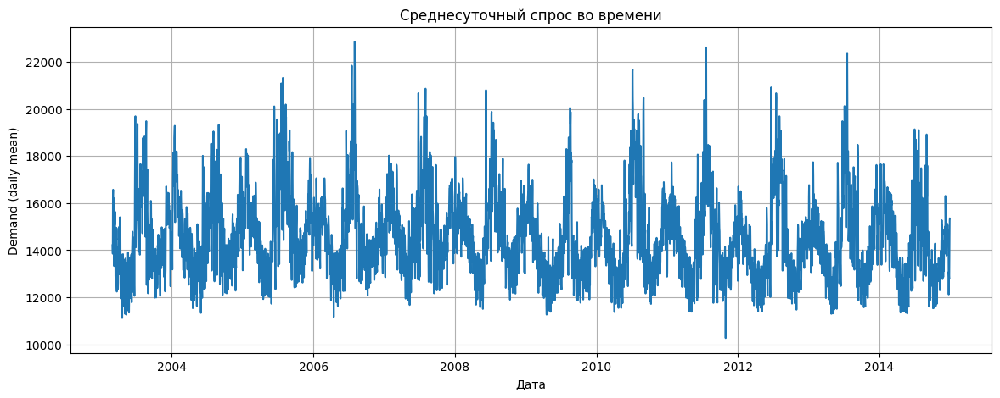

*Среднесуточный спрос во времени*

На среднесуточном графике видны регулярные колебания нагрузки. Ряд не выглядит как белый шум: у него есть повторяющиеся сезонные участки, пики и периоды снижения. Это важно для выбора моделей: простые модели без сезонности будут систематически ошибаться.

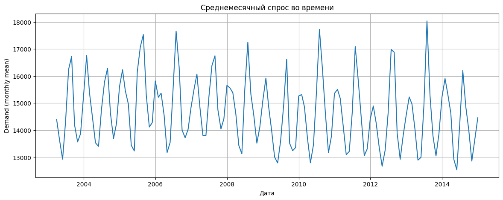

*Среднемесячный спрос во времени*

Среднемесячный график сглаживает часовые и дневные колебания. На нем отчетливее видна долгосрочная сезонность: пики и спады повторяются по годам. Это подтверждает необходимость учитывать годовую структуру или хотя бы сезонные календарные признаки.

## Распределение целевой переменной

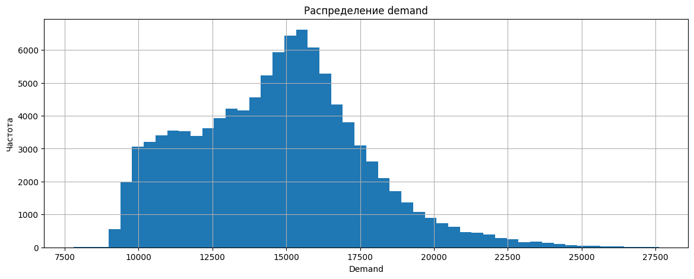

*Распределение demand*

Распределение не является нормальным: оно имеет выраженную центральную массу и правый хвост. Это означает, что крупные значения нагрузки встречаются реже, но могут существенно влиять на RMSE. Поэтому в последующих заданиях уместно смотреть не только RMSE, но и MAE, MAPE/WAPE.

## Суточный и недельный профиль

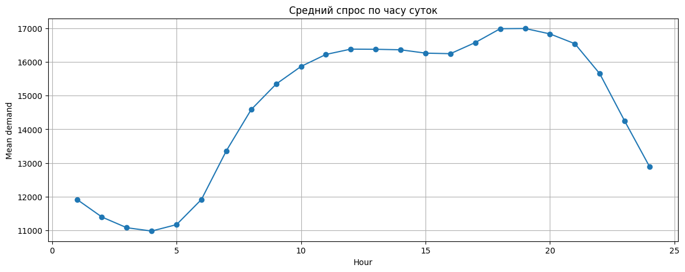

*Средний спрос по часу суток*

Суточный профиль выражен очень сильно. Нагрузка ниже ночью и утром, затем растет в течение дня и достигает максимума ближе к вечерним часам.

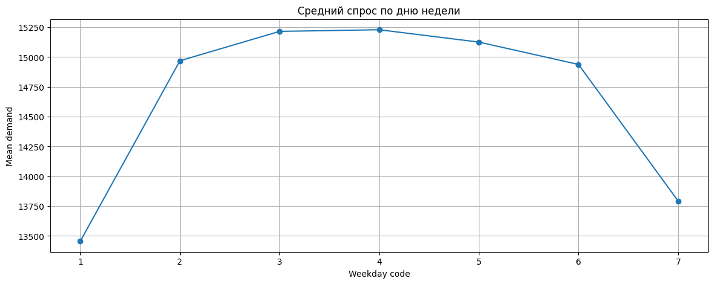

*Средний спрос по дню недели*

Недельный профиль также заметен: разные дни недели имеют разные средние уровни спроса. Это подтверждает, что ряд обладает не только суточной, но и недельной сезонностью.

## Декомпозиция и автокорреляция

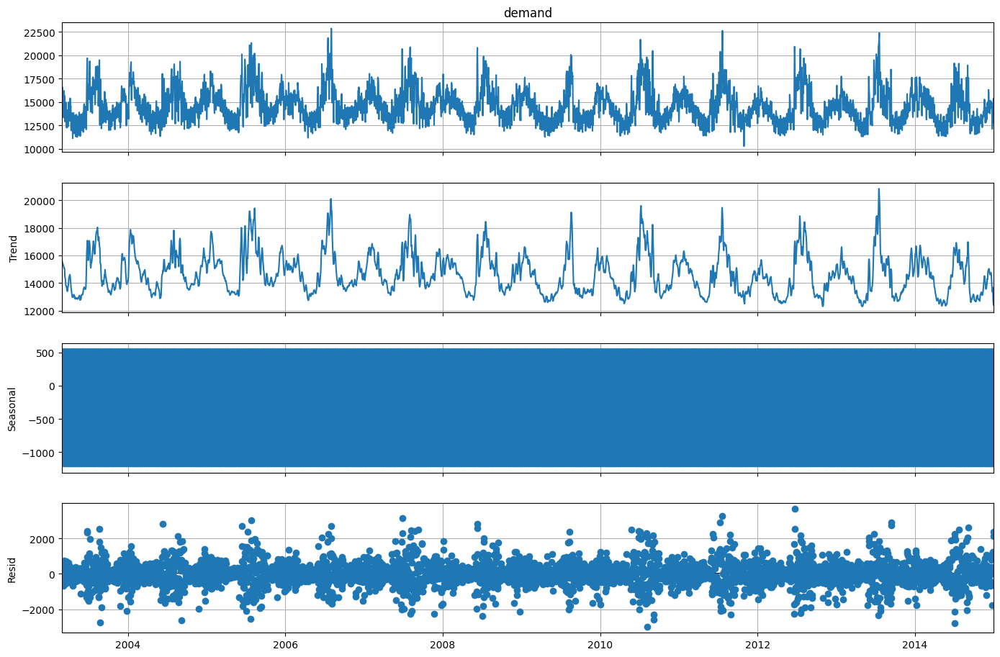

*Аддитивная декомпозиция среднесуточного ряда с периодом 7*

Декомпозиция показывает три важных компонента: тренд, сезонную составляющую и остатки. Сезонная компонента повторяется регулярно, а остатки содержат отдельные всплески. Это говорит, что для прогноза нужно использовать модели, способные отделять сезонность от базового уровня ряда.

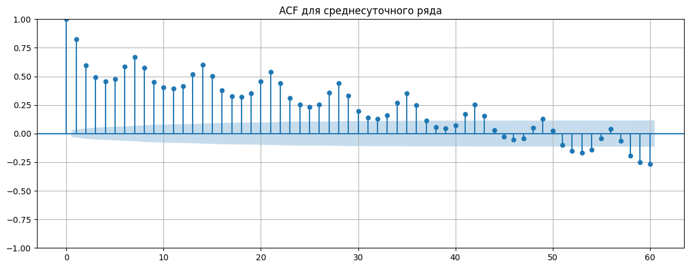

*ACF для среднесуточного ряда*

ACF показывает сильную зависимость текущих значений от прошлых. Корреляция убывает не сразу, а также имеет сезонные структуры. Это подтверждает, что авторегрессионные признаки и сезонные модели имеют смысл.

## Проверка стационарности

| Ряд | ADF statistic | p-value | lag | nobs |
|---|---:|---:|---:|---:|
| Исходный hourly ряд | -30.469904 | 0.000000 | 24 | 103751 |
| Первая разность | -52.995150 | 0.000000 | 24 | 103750 |

ADF-тест отвергает гипотезу о единичном корне как для исходного ряда, так и для первой разности. Однако из-за сильной сезонности это нельзя трактовать как полное отсутствие структуры в ряду. Даже при формальном результате ADF модель должна учитывать суточную и недельную сезонность.

---

# Задача №2. Статистические методы прогнозирования временного ряда

## Постановка задачи
Для сравнения использовался срез последних 1.5 лет данных:

| Параметр | Значение |
|---|---|
| Начало среза | 2013-07-02 12:00:00 |
| Конец среза | 2014-12-31 23:00:00 |
| Количество строк | 13,140 |
| Горизонт backtesting | 336 часов |
| Число окон | 3 |

Сравнивались модели `AutoETS`, `Theta`, `AutoTheta`, `SeasonalNaive`, `MSTL`. `ARIMA` Не включена в список, так как у временного ряда наблюдается явная сезонность, но `SARIMA` в наборе statsforecast отсутсвует. `AUTOARIMA` не используется, из-за отсутствия необходимых вычислительных мощностей.

## Сводная таблица качества моделей

| model         |    RMSE |     MAE |   MAPE_% |   sMAPE_% |   coverage_80 |   coverage_95 |   avg_width_95 |
|:--------------|--------:|--------:|---------:|----------:|--------------:|--------------:|---------------:|
| MSTL          | 1115.48 | 867.487 |   6.2573 |    6.1083 |        0.5238 |        0.6081 |        2154.05 |
| Theta         | 1233.53 | 984.733 |   6.9979 |    6.8713 |        0.6349 |        0.7302 |        3047.58 |
| AutoTheta     | 1233.53 | 984.733 |   6.9979 |    6.8713 |        0.6349 |        0.7302 |        3047.58 |
| AutoETS       | 1262.37 | 969.832 |   7.1161 |    6.7923 |        0.5585 |        0.6558 |        2704.58 |
| SeasonalNaive | 1296.48 | 969.495 |   7.1666 |    6.794  |        0.6022 |        0.6944 |        2794.79 |

Лучшая модель по RMSE — **MSTL**. Она также имеет лучший MAE среди статистических моделей. Это логично для данного ряда, потому что MSTL явно разлагает ряд на несколько сезонностей: суточную и недельную.

## Визуальное сравнение прогнозов

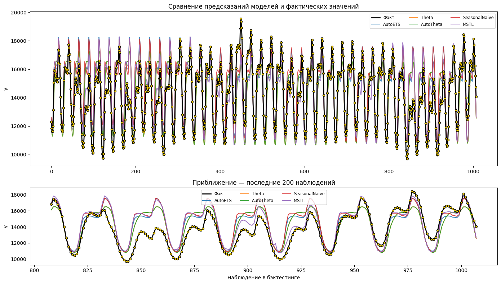

*Сравнение статистических моделей на backtesting*

На верхнем графике показано сравнение факта и прогнозов на всем участке backtesting. На нижнем графике сделано приближение последних 200 наблюдений. Почти все модели повторяют основную сезонную форму, но различаются по амплитуде и уровню. `MSTL` лучше удерживает форму ряда, поэтому и получает меньший RMSE.

## Анализ остатков лучшей статистической модели

| статистика   |   остаток MSTL |
|:-------------|---------------:|
| count        |      1008      |
| mean         |      -146.13   |
| std          |      1106.42   |
| min          |     -4311.93   |
| 25%          |      -896.798  |
| 50%          |        16.1356 |
| 75%          |       609.445  |
| max          |      2521.03   |

Среднее значение остатков для `MSTL` равно **-146.13**. Медиана близка к нулю.

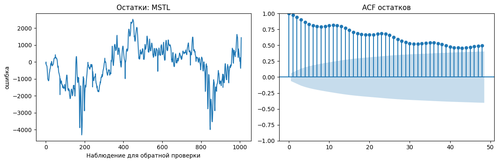

*Остатки MSTL и ACF остатков*

Левый график показывает, что остатки не выглядят как полностью случайный шум: есть участки последовательных положительных и отрицательных ошибок. Правый график ACF остатков показывает сильную автокорреляцию.

---

# Задача №3. Data-driven методы: ML, DL и аномалии

## Постановка задачи

В третьем ноутбуке исследовались методы машинного обучения, нейросетевые модели и методы поиска аномалий. Для анализа был взят последний год данных:

| Параметр | Значение |
|---|---|
| Начало | 2014-01-01 00:00:00 |
| Конец | 2014-12-31 23:00:00 |
| Количество строк | 8,760 |
| Train для CV | 8,256 строк, 2014-01-01 00:00:00 — 2014-12-10 23:00:00 |
| Тестовый/валидационный хвост CV | 504 часа |
| Горизонт одного окна CV | 168 часов |
| Число окон CV | 3 |

Для ML использовались `LinearRegression`, `Ridge`, `RandomForest`. Для DL использовались `NBEATS`, `NHITS`, `RNN`. Для выявления аномалий использовались `STL robust z-score`, `IsolationForest`, `LocalOutlierFactor`.

## Сравнение ML и DL моделей

| model            |    RMSE |      MAE |   MAPE_% | group   |
|:-----------------|--------:|---------:|---------:|:--------|
| RandomForest     | 1095.87 |  858.196 |   5.9252 | ML      |
| NBEATS           | 1097.01 |  845.992 |   5.7939 | DL      |
| NHITS            | 1103.02 |  833.823 |   5.7558 | DL      |
| RNN              | 1223.47 |  967.938 |   6.7226 | DL      |
| LinearRegression | 1618.95 | 1285.57  |   9.4462 | ML      |
| Ridge            | 1618.95 | 1285.58  |   9.4462 | ML      |

Лучшая модель по RMSE — **RandomForest**. Она чуть опережает `NBEATS`, но различие очень небольшое: RMSE отличается примерно на 1.14. При этом по MAE и MAPE лучшей выглядит `NHITS`, что говорит о различии моделей по типу ошибок.

Линейные модели заметно хуже: их RMSE около **1619**, тогда как RandomForest/NBEATS/NHITS находятся около **1096–1103**. Это означает, что простая линейная зависимость по лагам и календарным признакам недостаточна для данного ряда.

## Остатки лучших ML и DL моделей

График остатков показывает, что ошибки лучших ML/DL моделей имеют участки с последовательным смещением относительно нуля. Ljung–Box p-value для ML и DL на лаге 24 равен 0, поэтому остатки автокоррелированы.

## Поиск аномалий

| method             |   anomaly_count |
|:-------------------|----------------:|
| STL robust z-score |            1146 |
| IsolationForest    |              86 |
| LocalOutlierFactor |              86 |

Отдельно была проведена проверка на искусственно внедренных аномалиях:

| method        | found_true_anomalies | missed_true_anomalies | false_positives |
|:--------------|---------------------:|----------------------:|----------------:|
| anom_stl      |                   23 |                     1 |            1123 |
| anom_iforest  |                    1 |                    23 |              85 |
| anom_lof      |                   20 |                     4 |              66 |

По этой проверке `STL robust z-score` имеет высокий recall на искусственно внедренных аномалиях, но слишком много ложных срабатываний. `IsolationForest` оказался слишком консервативным и почти не поймал injected anomalies. `LocalOutlierFactor` выглядит более сбалансированным среди трех проверенных методов: он нашел 20 из 24 искусственных аномальных точек и дал меньше ложных срабатываний, чем STL.

---

# Задача №4. Итоговый пайплайн и сравнение двух подходов

| Источник | Выбранный пайплайн | Причина выбора |
|---|---|---|
| Задача №2 | `MSTL + Holt` | Лучшая статистическая модель, хорошо работает с несколькими сезонностями. |
| Задача №3 | `RandomForest recursive` | Лучший data-driven метод по RMSE среди ML/DL сравнения. |

Оба пайплайна были проверены на едином holdout-периоде: последние **504 часа** 2014 года.

| Часть данных | Строки | Период |
|---|---:|---|
| Полный подготовленный ряд | 103,776 | 2003-03-01 — 2014-12-31 23:00 |
| Рабочий последний год | 8,760 | 2014-01-01 — 2014-12-31 23:00 |
| Train | 8,256 | 2014-01-01 — 2014-12-10 23:00 |
| Test | 504 | 2014-12-11 — 2014-12-31 23:00 |

## Таблица итоговых метрик

| pipeline               |   fit_predict_sec |    RMSE |     MAE |   MAPE_% |   sMAPE_% |   WAPE_% |   Bias_pred_minus_fact |
|:-----------------------|------------------:|--------:|--------:|---------:|----------:|---------:|-----------------------:|
| RandomForest recursive |            8.3836 | 1127.62 | 816.427 |   5.9222 |    5.6834 |   5.7066 |                393.385 |
| MSTL + Holt            |            3.3268 | 1142.02 | 783.812 |   5.8095 |    5.4751 |   5.4787 |                682.64  |

По RMSE немного лучше `RandomForest recursive`: преимущество составляет около **14.40** единиц. По MAE и WAPE лучше `MSTL + Holt`: преимущество по MAE составляет около **32.61** единиц. По скорости `MSTL + Holt` быстрее примерно в **2.52** раза.

## Графики прогноза на holdout

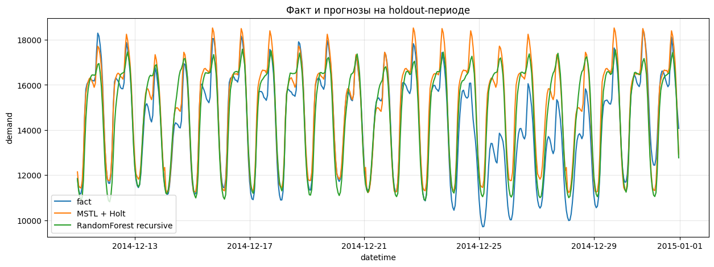

*Факт и прогнозы на всем holdout-периоде*

На полном holdout видно, что оба пайплайна воспроизводят суточную сезонность. `RandomForest recursive` часто держится ближе к факту на отдельных пиках, что помогает RMSE. `MSTL + Holt` дает более сглаженный и регулярный прогноз. Это объяснимо: MSTL моделирует сезонную структуру явно, а RandomForest использует лаговые и календарные признаки.

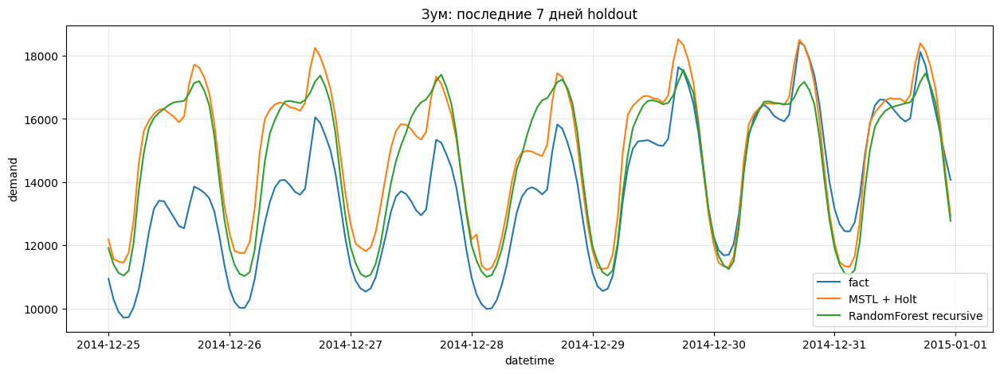

*Приближение последней недели holdout*

На приближении последней недели лучше видны локальные различия. `MSTL + Holt` хорошо повторяет регулярный суточный профиль, но может не успевать за резкими изменениями уровня. `RandomForest recursive` местами ближе к факту, но также может давать смещение, так как рекурсивный прогноз использует собственные предыдущие предсказания.

## Анализ ошибок

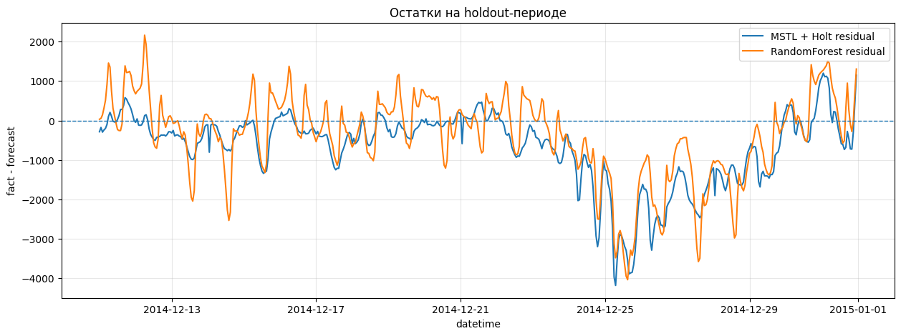

*Остатки на holdout-периоде*

График остатков показывает, что ошибки обеих моделей не являются полностью случайными. Есть интервалы, где остатки последовательно находятся выше или ниже нуля. Это говорит о сохраняющейся структуре ошибок: модели не полностью описывают все изменения нагрузки.

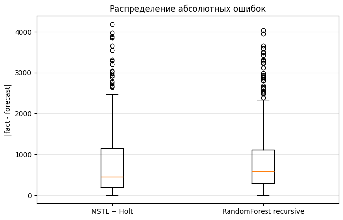

*Распределение абсолютных ошибок*

Boxplot сравнивает абсолютные ошибки двух пайплайнов. У `MSTL + Holt` медианная абсолютная ошибка немного ниже, чем у `RandomForest recursive`, поэтому в типичном случае статистический пайплайн ошибается меньше. При этом у обеих моделей есть крупные выбросы, где ошибка превышает 2500–4000 единиц. Это означает, что резкие изменения нагрузки или нестандартные периоды остаются сложными для обоих подходов.

Этот график хорошо объясняет расхождение метрик: `MSTL + Holt` лучше по MAE/WAPE, потому что типичная ошибка ниже, но `RandomForest recursive` немного лучше по RMSE, так как квадрат ошибки сильнее реагирует на отдельные крупные промахи.

## Производительность и метрики

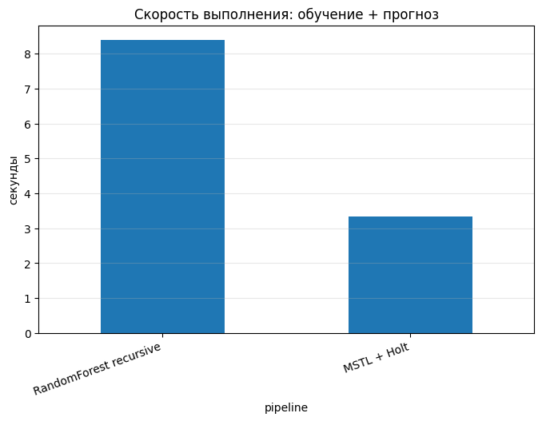

*Скорость обучения и прогноза*

`MSTL + Holt` выполняется заметно быстрее.

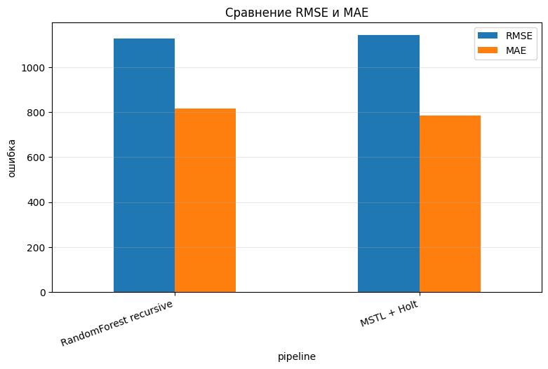

*Сравнение RMSE и MAE*

На графике метрик видно, что различия между моделями не радикальные. RandomForest немного выигрывает по RMSE, а MSTL + Holt выигрывает по MAE.

## Важность признаков RandomForest

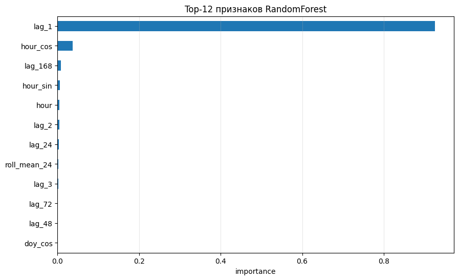

*Top-12 признаков RandomForest*

Самым важным признаком оказался `lag_1`. Это значит, что модель в основном опирается на последнее известное значение ряда.

## Статистическое сравнение пайплайнов

| test                                    | statistic   |   p_value | interpretation                                               | loss     | mean_loss_diff_pipeline1_minus_pipeline2   | dm_like_stat   | hac_lags   |
|:----------------------------------------|:------------|----------:|:-------------------------------------------------------------|:---------|:-------------------------------------------|:---------------|:-----------|
| paired t-test on absolute errors        | -1.3962     |    0.1633 | H0: средние абсолютные ошибки равны                          | nan      |                                            |                |            |
| Wilcoxon signed-rank on absolute errors | 61300.0000  |    0.4763 | H0: медианная разница абсолютных ошибок равна 0              | nan      |                                            |                |            |
| DM-like test on squared errors          |             |    0.8389 | H0: одинаковая точность по squared loss; diff > 0 хуже MSTL  | squared  | 32685.1241                                 | 0.2034         | 24.0000    |
| DM-like test on absolute errors         |             |    0.6255 | H0: одинаковая точность по absolute loss; diff > 0 хуже MSTL | absolute | -32.6148                                   | -0.4884        | 24.0000    |

Все p-value статистических сравнений выше 0.05. Это значит, что на данном holdout-периоде нет убедимого статистического основания утверждать, что один пайплайн существенно лучше другого. Различия в метриках есть, но они не подтверждаются как статистически значимые.

Исследование показывает, что временной ряд `demand` хорошо прогнозируется моделями, которые учитывают сезонность и лаговую структуру. Разница между лучшей статистической и лучшей data-driven моделью оказалась небольшой.